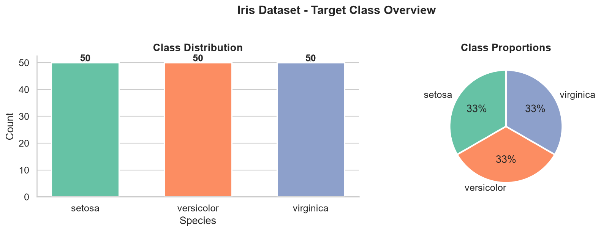
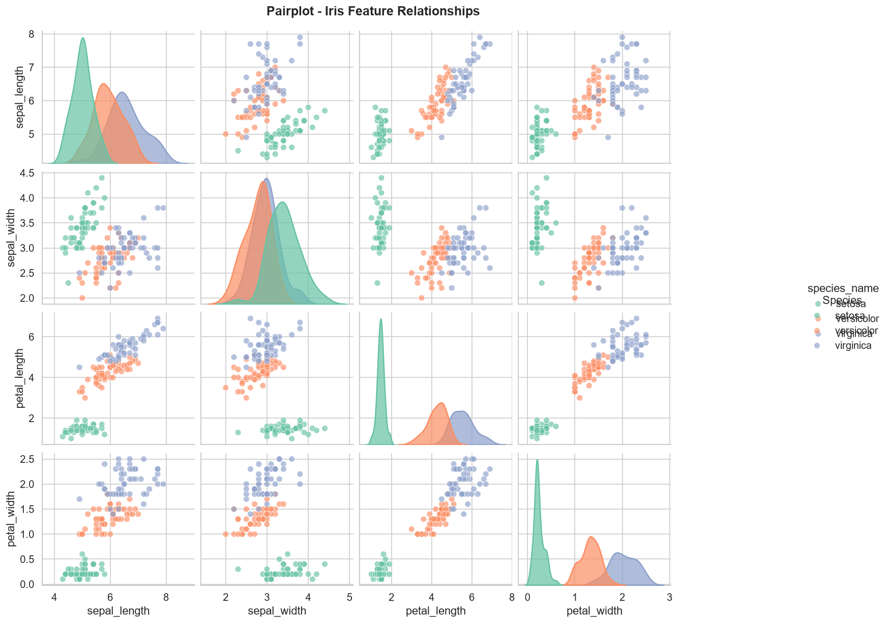
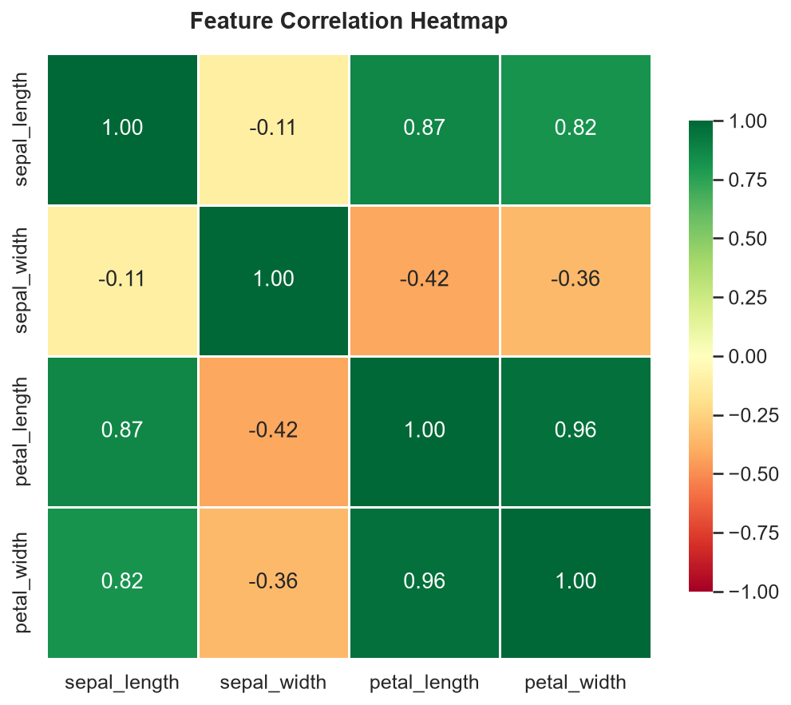
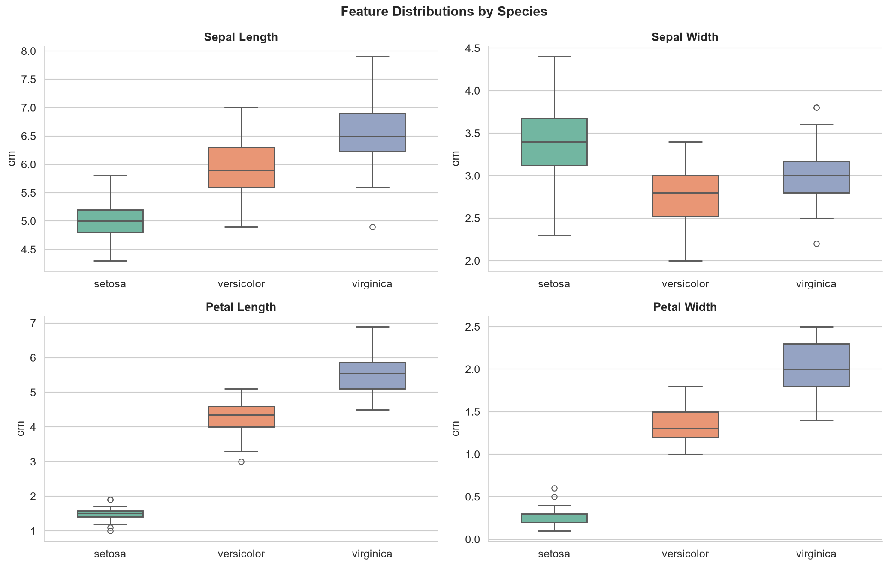
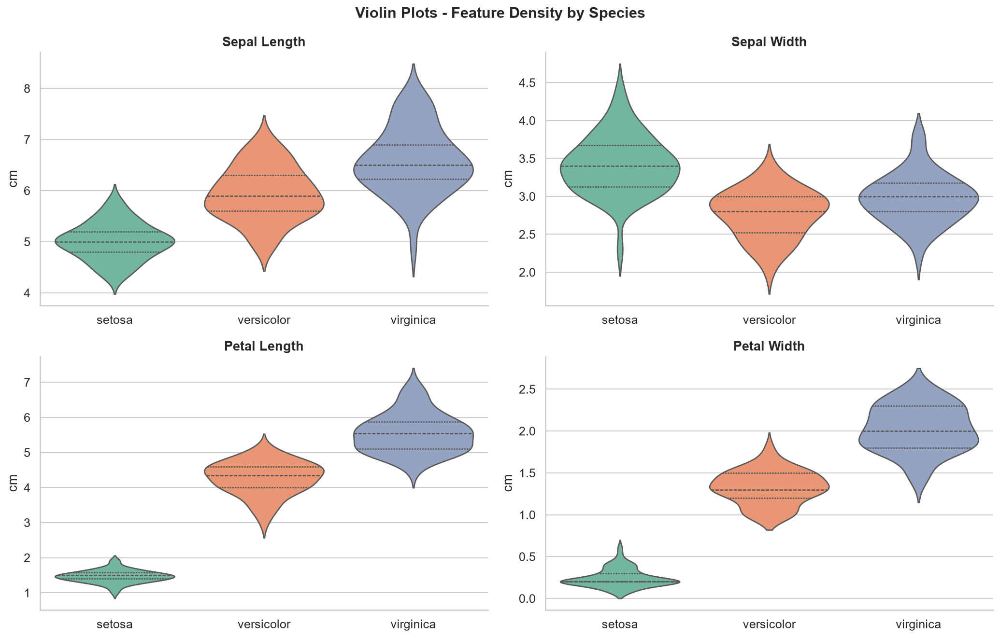
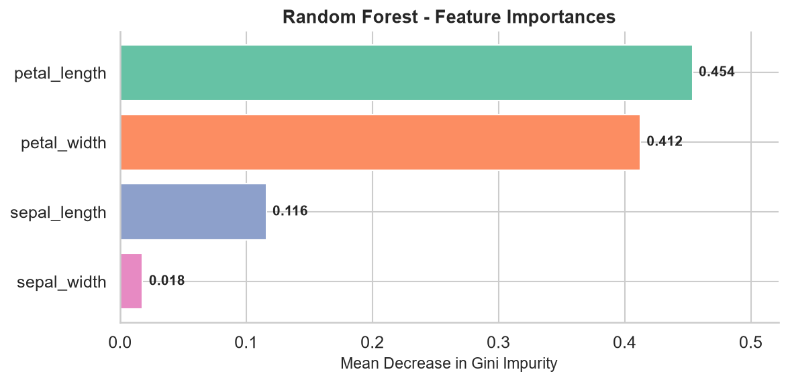
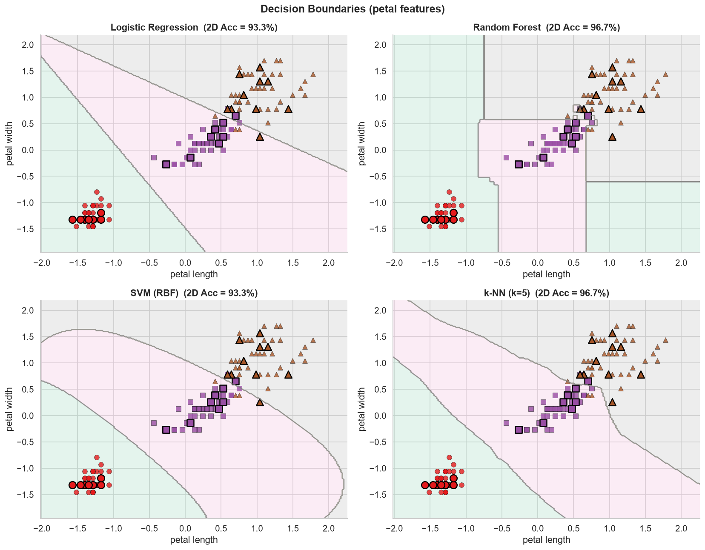

# 🌸CodeAlpha_01
#  Iris Flower Classification

## 📌 Project Overview

This project is a Machine Learning classification model that predicts the species of Iris flowers using Scikit-Learn.

The project includes:

- Data Preprocessing
- Exploratory Data Analysis (EDA)
- Data Visualization
- Model Training
- Model Evaluation
- Prediction

---

## 🚀 Technologies Used

- Python
- Pandas
- NumPy
- Matplotlib
- Seaborn
- Scikit-Learn
- Jupyter Notebook

---

## 📊 Dataset

The Iris dataset contains:

- 150 flower samples
- 4 input features
- 3 flower species

Features:

- Sepal Length
- Sepal Width
- Petal Length
- Petal Width

Species:

- Setosa
- Versicolor
- Virginica

---

## 📈 Visualizations

- Class Distribution
- Pair Plot
- Correlation Heatmap
- Boxplots
- Violin Plots
- Feature Importance
- Decision Boundary

---

## 🤖 Machine Learning

The project trains classification models and evaluates their performance using Scikit-Learn.

---

## 📂 Project Structure

README.md
RESULTS_SUMMARY.md
output_report.html
pairplot.png
boxplots.png
correlation_heatmap.png
class_distribution.png
feature_importances.png
decision_boundaries.png

---

## ▶️ How to Run

Clone the repository

```bash
git clone https://github.com/YOUR_USERNAME/Iris-Flower-Classification.git
```

Install dependencies

```bash
pip install -r requirements.txt
```

Run the notebook.

---

## 📜 License

MIT License

## 📸 Project Output

### Class Distribution


### Pair Plot


### Correlation Heatmap


### Boxplots


### Violin Plots


### Feature Importance


### Decision Boundary

